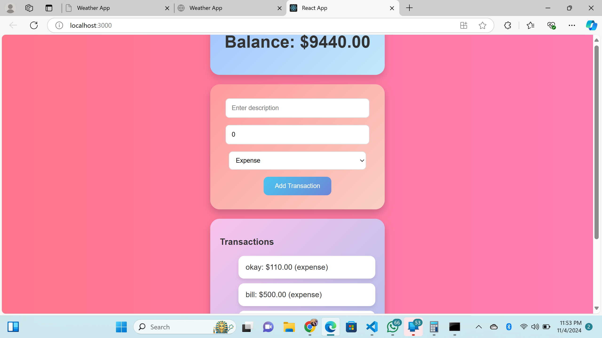

# Expense Tracker

An interactive expense tracker application built using React and Firebase, designed to help users manage their income and expenses efficiently. This application features a visually appealing interface with animations, gradient backgrounds, and modern styling to provide a memorable user experience.

## Features

- **Add Transactions**: Users can add expenses or income by providing a description and amount.
- **Track Balance**: Automatically calculates the total balance based on transactions entered.
- **Real-Time Updates**: Firebase integration allows real-time updates for transactions and balance.
- **Responsive UI**: Beautifully styled components with gradient colors and animations for an engaging interface.

## Technologies Used

- **React**: Front-end framework for building user interfaces.
- **Firebase Firestore**: NoSQL database for real-time data storage.
- **Styled Components**: Styling solution to create component-level styles in JavaScript.
- **Framer Motion**: Library for adding animations and enhancing user interactivity.

## Installation

To get a local copy up and running, follow these simple steps:

### Prerequisites

- Node.js (version 14 or higher)
- npm (comes with Node.js)

### Installation Steps

1. **Clone the Repository**
   ```bash
   git clone https://github.com/yourusername/expense-tracker.git
   cd expense-tracker
   ```

2. **Install Dependencies**
   ```bash
   npm install
   npm install firebase framer-motion@5.5.0 styled-components
   ```

3. **Firebase Setup**
   - Create a Firebase project in [Firebase Console](https://console.firebase.google.com/).
   - Set up Firestore and add your Firebase credentials to the `firebase.js` file in the project.

4. **Run the Application**
   ```bash
   npm start
   ```
   - The application will run on `http://localhost:3000`.

## Firebase Configuration

Create a `firebase.js` file in the `src` directory and add your Firebase configuration:

```javascript
import { initializeApp } from 'firebase/app';
import { getFirestore } from 'firebase/firestore';

const firebaseConfig = {
    apiKey: 'YOUR_FIREBASE_API_KEY',
    authDomain: 'YOUR_FIREBASE_AUTH_DOMAIN',
    projectId: 'YOUR_FIREBASE_PROJECT_ID',
    storageBucket: 'YOUR_FIREBASE_STORAGE_BUCKET',
    messagingSenderId: 'YOUR_FIREBASE_MESSAGING_SENDER_ID',
    appId: 'YOUR_FIREBASE_APP_ID'
};

const app = initializeApp(firebaseConfig);
const db = getFirestore(app);

export default db;
```
Replace `YOUR_FIREBASE_API_KEY` and other placeholders with actual values from your Firebase console.

## Deployment

To deploy the application using Firebase Hosting:

1. **Install Firebase CLI**
   ```bash
   npm install -g firebase-tools
   ```

2. **Login to Firebase**
   ```bash
   firebase login
   ```

3. **Initialize Firebase Hosting**
   ```bash
   firebase init
   ```

4. **Build and Deploy**
   ```bash
   npm run build
   firebase deploy
   ```

The deployment URL will be provided after a successful deploy.

## Usage

- **Add Transaction**: Fill in the description and amount, then choose between "Expense" or "Income".
- **View Balance**: The balance is calculated in real-time based on all entered transactions.
- **Transaction List**: View all transactions added, with income and expenses clearly labeled.

## Screenshots

(image.png)

## License

This project is licensed under the MIT License.

## Acknowledgments

- **React Documentation**: [React](https://reactjs.org/docs/getting-started.html)
- **Firebase Documentation**: [Firebase](https://firebase.google.com/docs)
- **Framer Motion**: [Framer Motion](https://www.framer.com/motion/)

Feel free to reach out if you have any questions or suggestions for improvement!

## Contributing

Contributions are welcome! Feel free to fork the repository and submit pull requests to suggest improvements or new features.
